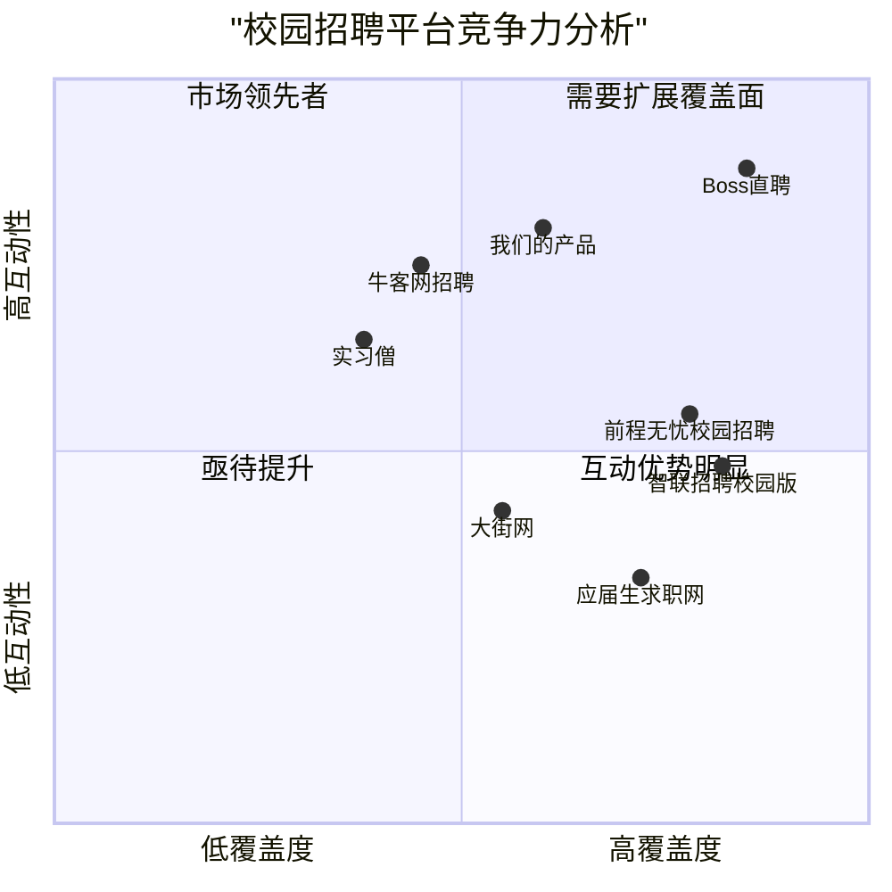

# 校园招聘系统PRD（超级简易版Boss直聘）

## 1. 项目概述

### 1.1 项目背景

随着互联网招聘模式的普及，校园招聘也在不断向线上化、精准化、高效化方向发展。传统的校园招聘存在信息不对称、效率低下等问题，亟需一个简单高效的招聘平台连接校园人才与企业。本项目旨在开发一款简化版的Boss直聘风格的校园招聘系统，聚焦于校园招聘场景，提供后端API支持。

### 1.2 项目目标

1. 构建一个面向高校学生和企业的校园招聘平台，实现求职者与招聘方的直接对接
2. 提高校园招聘的效率和精准度，减少信息不对称问题
3. 为企业提供高效便捷的校园人才获取渠道

### 1.3 用户群体

- **学生/求职者**：应届毕业生、在校大学生
- **企业/招聘者**：有校园招聘需求的各类企业HR、招聘负责人
- **管理员**：系统运营和维护人员

## 2. 产品定义

### 2.1 产品目标

1. **高效连接**：打造高效的校园人才与企业对接平台，缩短招聘周期
2. **精准匹配**：基于学生专业、技能与企业岗位需求，实现精准推荐匹配
3. **简单易用**：提供简洁流畅的使用体验，降低各方使用门槛

### 2.2 用户故事

1. **作为应届毕业生**，我希望能够快速找到符合我专业和兴趣的工作岗位，以便顺利完成从校园到职场的过渡。
2. **作为在校大学生**，我希望能够了解不同企业和岗位的信息和要求，以便提前规划自己的职业方向和能力培养。
3. **作为企业HR**，我希望能够高效地发布校招岗位信息并筛选合适的候选人，以便降低招聘成本并提高招聘质量。
4. **作为招聘负责人**，我希望能够直接与潜在候选人沟通，以便更准确地评估其能力和文化契合度。
5. **作为系统管理员**，我希望能够有效监控和管理平台运营情况，以便保障系统的安全和正常运行。

### 2.3 竞品分析

| 产品名称 | 优势 | 劣势 |
| --- | --- | --- |
| Boss直聘 | 直聊模式高效、用户体验好、覆盖范围广 | 针对校园场景的定制化功能不足、信息噪音较多 |
| 前程无忧校园招聘 | 校园资源丰富、校招流程完善 | 直接沟通渠道受限、操作流程较繁琐 |
| 智联招聘校园版 | 企业资源丰富、知名度高 | 互动性不足、用户体验一般 |
| 应届生求职网 | 内容垂直度高、信息量大 | 产品体验较差、功能相对落后 |
| 牛客网招聘版块 | 技术人才集中、社区氛围好 | 行业覆盖有限、非招聘主业 |
| 大街网 | 校企合作模式成熟 | 平台活跃度不高、创新能力不足 |
| 实习僧 | 实习岗位资源丰富、针对性强 | 全职岗位相对较少、功能单一 |

### 2.4 竞争力象限图




## 3. 功能规格

### 3.1 系统架构

本系统采用前后端分离架构，本PRD主要描述后端API部分：

- 前端：不在本期开发范围内
- 后端：基于Java Spring Boot框架开发RESTful API
- 数据库：MySQL关系型数据库
- 认证：JWT令牌认证

### 3.2 核心功能模块

#### 3.2.1 用户账户管理

**功能描述**：管理系统中的用户账户，包括学生/求职者、企业/招聘者和管理员三种角色。

**主要功能**：
- 用户注册：支持学生和企业两种不同角色的注册流程
- 用户登录：基于JWT的身份验证
- 用户信息管理：修改、查询个人或企业信息
- 账户安全：密码重置、账号注销等

**API需求**：
- `POST /api/auth/register` - 用户注册
- `POST /api/auth/login` - 用户登录
- `GET /api/auth/current` - 获取当前登录用户信息
- `PUT /api/users/{id}` - 更新用户信息

#### 3.2.2 企业管理模块

**功能描述**：企业用户管理自身信息、认证状态等。

**主要功能**：
- 企业资料管理：基本信息、公司介绍、企业规模等
- 企业认证：上传营业执照等资质材料进行认证
- 企业形象：公司照片、企业文化展示

**API需求**：
- `GET /api/companies/{id}` - 获取企业详情
- `POST /api/companies` - 创建企业信息
- `PUT /api/companies/{id}` - 更新企业信息
- `POST /api/companies/{id}/verification` - 提交企业认证

#### 3.2.3 招聘信息管理

**功能描述**：企业发布、管理招聘信息，学生浏览、筛选招聘信息。

**主要功能**：
- 岗位发布：企业发布校园招聘岗位
- 岗位管理：修改、下架、重新发布岗位
- 岗位搜索：按条件筛选岗位（专业、城市、薪资等）
- 岗位推荐：基于学生专业、技能的个性化岗位推荐

**API需求**：
- `GET /api/jobs` - 获取所有招聘信息
- `GET /api/jobs/{id}` - 获取招聘信息详情
- `POST /api/jobs` - 发布招聘信息
- `PUT /api/jobs/{id}` - 更新招聘信息
- `DELETE /api/jobs/{id}` - 删除招聘信息
- `GET /api/jobs/search` - 搜索招聘信息(带条件筛选)
- `GET /api/jobs/recommend` - 获取推荐岗位

#### 3.2.4 简历管理

**功能描述**：学生创建、管理个人简历，企业查看收到的简历。

**主要功能**：
- 简历创建：学生创建个人简历
- 简历管理：更新、删除简历
- 简历投递：向目标岗位投递简历
- 简历收藏：企业收藏优质简历

**API需求**：
- `GET /api/resumes/{id}` - 获取简历详情
- `POST /api/resumes` - 创建简历
- `PUT /api/resumes/{id}` - 更新简历
- `DELETE /api/resumes/{id}` - 删除简历
- `GET /api/students/{id}/resumes` - 获取学生的所有简历

#### 3.2.5 申请流程管理

**功能描述**：管理学生的职位申请和企业的申请处理流程。

**主要功能**：
- 职位申请：学生向企业岗位申请
- 申请追踪：查看申请状态（待处理、已查看、面试邀约、录用、拒绝）
- 申请处理：企业处理收到的申请

**API需求**：
- `POST /api/jobs/{jobId}/apply` - 申请职位
- `GET /api/students/{id}/applications` - 获取学生的所有申请
- `GET /api/companies/{id}/applications` - 获取企业收到的所有申请
- `PUT /api/applications/{id}/status` - 更新申请状态

#### 3.2.6 消息通知

**功能描述**：系统内部的消息通知功能。

**主要功能**：
- 系统通知：平台公告、活动提醒等
- 申请通知：简历投递、状态变更等通知
- 消息提醒：未读消息提醒

**API需求**：
- `GET /api/notifications` - 获取用户通知
- `PUT /api/notifications/{id}/read` - 标记通知为已读
- `DELETE /api/notifications/{id}` - 删除通知

#### 3.2.7 管理员功能

**功能描述**：系统管理员对平台进行管理和维护。

**主要功能**：
- 用户管理：查看、禁用用户
- 内容审核：审核企业信息、职位信息
- 数据统计：查看平台运营数据

**API需求**：
- `GET /api/admin/users` - 获取所有用户
- `PUT /api/admin/users/{id}/status` - 更新用户状态
- `GET /api/admin/jobs/review` - 获取待审核职位
- `PUT /api/admin/jobs/{id}/status` - 更新职位审核状态
- `GET /api/admin/statistics` - 获取系统统计数据


### 3.3 数据模型

#### 3.3.1 用户(User)
```
id: Long (主键)
username: String (用户名)
password: String (密码，加密存储)
email: String (邮箱)
phone: String (电话)
role: Enum (STUDENT, COMPANY, ADMIN)
createTime: DateTime (创建时间)
updateTime: DateTime (更新时间)
status: Enum (ACTIVE, INACTIVE, BANNED)
```

#### 3.3.2 学生(Student)
```
id: Long (主键，关联User)
realName: String (真实姓名)
university: String (学校)
major: String (专业)
education: Enum (专科, 本科, 硕士, 博士)
graduationYear: String (毕业年份)
gender: Enum (男, 女, 保密)
birth: Date (出生日期)
location: String (所在地)
expectedPosition: String (期望职位)
expectedSalary: String (期望薪资)
expectedCity: String (期望城市)
```

#### 3.3.3 企业(Company)
```
id: Long (主键，关联User)
companyName: String (企业名称)
industry: String (所属行业)
scale: String (企业规模)
description: Text (企业描述)
location: String (企业地址)
website: String (企业官网)
logo: String (企业logo URL)
verified: Boolean (是否已认证)
verificationFiles: String (认证材料 URL)
contactPerson: String (联系人)
contactPosition: String (联系人职位)
```

#### 3.3.4 职位(Job)
```
id: Long (主键)
companyId: Long (关联企业ID)
title: String (职位名称)
description: Text (职位描述)
requirements: Text (任职要求)
salary: String (薪资范围)
location: String (工作地点)
positionType: Enum (全职, 实习, 兼职)
educationRequirement: String (学历要求)
majorRequirement: String (专业要求)
publishDate: DateTime (发布时间)
deadline: DateTime (截止日期)
status: Enum (DRAFT, PUBLISHED, CLOSED, DELETED)
viewCount: Integer (浏览次数)
applyCount: Integer (申请次数)
```

#### 3.3.5 简历(Resume)
```
id: Long (主键)
studentId: Long (关联学生ID)
name: String (简历名称)
education: Text (教育经历)
experience: Text (实习/工作经历)
skills: Text (技能特长)
projects: Text (项目经历)
awards: Text (获奖情况)
selfEvaluation: Text (自我评价)
attachmentUrl: String (附件URL)
createTime: DateTime (创建时间)
updateTime: DateTime (更新时间)
```

#### 3.3.6 申请(Application)
```
id: Long (主键)
jobId: Long (关联职位ID)
studentId: Long (关联学生ID)
resumeId: Long (关联简历ID)
applyTime: DateTime (申请时间)
status: Enum (PENDING, VIEWED, INTERVIEW, OFFER, REJECTED)
remarks: Text (备注)
feedback: Text (企业反馈)
lastUpdateTime: DateTime (最近更新时间)
```

#### 3.3.7 通知(Notification)
```
id: Long (主键)
userId: Long (接收用户ID)
title: String (通知标题)
content: Text (通知内容)
type: Enum (SYSTEM, APPLICATION, MESSAGE)
relatedId: Long (关联ID，如申请ID)
isRead: Boolean (是否已读)
createTime: DateTime (创建时间)
```


## 4. 技术规格

### 4.1 后端技术架构

- **开发语言**: Java 11+
- **框架**: Spring Boot 2.7+
- **API设计**: RESTful API
- **数据库**: MySQL 8.0+
- **ORM框架**: MyBatis/Spring Data JPA
- **安全认证**: Spring Security + JWT
- **文档工具**: Swagger/OpenAPI
- **缓存**: Redis (可选)

### 4.2 API标准

#### 4.2.1 通用规范

- 采用RESTful API设计风格
- 使用HTTPS协议
- API版本控制: 在URL中使用版本号，如 `/api/v1/jobs`
- 返回格式: JSON
- HTTP状态码使用规范:
  - 200: 成功
  - 201: 创建成功
  - 400: 请求参数错误
  - 401: 未认证
  - 403: 无权限
  - 404: 资源不存在
  - 500: 服务器错误

#### 4.2.2 响应数据格式

```json
{
  "code": 200,        // 业务状态码
  "message": "success", // 状态描述
  "data": {          // 业务数据
    // 具体业务数据
  },
  "timestamp": 1673567890123 // 时间戳
}
```

#### 4.2.3 分页格式

```json
{
  "code": 200,
  "message": "success",
  "data": {
    "content": [],   // 数据列表
    "totalElements": 100, // 总记录数
    "totalPages": 10,    // 总页数
    "size": 10,         // 每页大小
    "number": 0,        // 当前页码
    "first": true,      // 是否第一页
    "last": false       // 是否最后一页
  },
  "timestamp": 1673567890123
}
```

### 4.3 安全设计

#### 4.3.1 认证与授权

- **JWT认证**: 用户登录后获取JWT令牌，后续请求通过令牌认证
- **角色权限**: 基于RBAC模型，定义STUDENT、COMPANY、ADMIN三种角色
- **接口权限**: 不同角色拥有不同的API访问权限

#### 4.3.2 数据安全

- 用户密码使用BCrypt加密存储
- 敏感信息传输采用HTTPS加密
- 实现防SQL注入、XSS攻击等安全措施
- 限制API访问频率，防止恶意请求

## 5. API文档

以下是系统的主要API接口文档，详细说明了每个接口的URL、方法、参数和响应格式。

### 5.1 认证API

#### 5.1.1 用户注册

- **URL**: `/api/auth/register`
- **方法**: POST
- **描述**: 注册新用户
- **请求参数**:
  ```json
  {
    "username": "student123",
    "password": "SecurePassword123",
    "email": "student@university.edu",
    "phone": "13800138000",
    "role": "STUDENT",  // 或 "COMPANY"
    // STUDENT角色额外参数
    "studentInfo": {
      "realName": "张三",
      "university": "北京大学",
      "major": "计算机科学",
      "education": "本科",
      "graduationYear": "2024"
    },
    // COMPANY角色额外参数
    "companyInfo": {
      "companyName": "科技有限公司",
      "industry": "互联网",
      "scale": "100-499人",
      "description": "公司简介...",
      "location": "北京市海淀区"
    }
  }
  ```
- **响应**:
  ```json
  {
    "code": 200,
    "message": "注册成功",
    "data": {
      "userId": 12345,
      "username": "student123",
      "role": "STUDENT"
    },
    "timestamp": 1673567890123
  }
  ```


#### 5.1.2 用户登录

- **URL**: `/api/auth/login`
- **方法**: POST
- **描述**: 用户登录获取令牌
- **请求参数**:
  ```json
  {
    "username": "student123",
    "password": "SecurePassword123"
  }
  ```
- **响应**:
  ```json
  {
    "code": 200,
    "message": "登录成功",
    "data": {
      "userId": 12345,
      "username": "student123",
      "role": "STUDENT",
      "token": "eyJhbGciOiJIUzI1NiIsInR5cCI6IkpXVCJ9...",
      "expireTime": 1673654290123
    },
    "timestamp": 1673567890123
  }
  ```

### 5.2 职位API

#### 5.2.1 发布职位

- **URL**: `/api/jobs`
- **方法**: POST
- **描述**: 企业发布招聘信息
- **请求头**: `Authorization: Bearer {token}`
- **请求参数**:
  ```json
  {
    "title": "Java后端开发工程师",
    "description": "职位描述...",
    "requirements": "任职要求...",
    "salary": "15k-25k",
    "location": "北京",
    "positionType": "全职",
    "educationRequirement": "本科",
    "majorRequirement": "计算机相关专业",
    "deadline": "2024-06-30T23:59:59"
  }
  ```
- **响应**:
  ```json
  {
    "code": 200,
    "message": "职位发布成功",
    "data": {
      "jobId": 67890,
      "title": "Java后端开发工程师",
      "publishDate": "2024-02-26T15:30:45"
    },
    "timestamp": 1673567890123
  }
  ```

#### 5.2.2 职位搜索

- **URL**: `/api/jobs/search`
- **方法**: GET
- **描述**: 按条件搜索职位
- **请求参数**:
  - `keyword`: 关键词（可选）
  - `location`: 地点（可选）
  - `education`: 学历要求（可选）
  - `positionType`: 职位类型（可选）
  - `salary`: 薪资范围（可选）
  - `page`: 页码（默认0）
  - `size`: 每页大小（默认10）
- **响应**:
  ```json
  {
    "code": 200,
    "message": "success",
    "data": {
      "content": [
        {
          "jobId": 67890,
          "companyId": 12345,
          "companyName": "科技有限公司",
          "companyLogo": "http://example.com/logo.png",
          "title": "Java后端开发工程师",
          "salary": "15k-25k",
          "location": "北京",
          "educationRequirement": "本科",
          "publishDate": "2024-02-26T15:30:45"
        },
        // 更多职位...
      ],
      "totalElements": 100,
      "totalPages": 10,
      "size": 10,
      "number": 0,
      "first": true,
      "last": false
    },
    "timestamp": 1673567890123
  }
  ```

### 5.3 简历API

#### 5.3.1 创建简历

- **URL**: `/api/resumes`
- **方法**: POST
- **描述**: 学生创建个人简历
- **请求头**: `Authorization: Bearer {token}`
- **请求参数**:
  ```json
  {
    "name": "我的简历",
    "education": "教育经历内容...",
    "experience": "实习经历内容...",
    "skills": "技能特长内容...",
    "projects": "项目经历内容...",
    "awards": "获奖情况内容...",
    "selfEvaluation": "自我评价内容..."
  }
  ```
- **响应**:
  ```json
  {
    "code": 200,
    "message": "简历创建成功",
    "data": {
      "resumeId": 23456,
      "name": "我的简历",
      "createTime": "2024-02-26T16:45:30"
    },
    "timestamp": 1673567890123
  }
  ```

### 5.4 申请API

#### 5.4.1 申请职位

- **URL**: `/api/jobs/{jobId}/apply`
- **方法**: POST
- **描述**: 学生申请职位
- **请求头**: `Authorization: Bearer {token}`
- **请求参数**:
  ```json
  {
    "resumeId": 23456,
    "coverLetter": "申请理由..."
  }
  ```
- **响应**:
  ```json
  {
    "code": 200,
    "message": "申请成功",
    "data": {
      "applicationId": 34567,
      "jobTitle": "Java后端开发工程师",
      "companyName": "科技有限公司",
      "status": "PENDING",
      "applyTime": "2024-02-26T17:20:15"
    },
    "timestamp": 1673567890123
  }
  ```

#### 5.4.2 更新申请状态

- **URL**: `/api/applications/{id}/status`
- **方法**: PUT
- **描述**: 企业更新学生申请状态
- **请求头**: `Authorization: Bearer {token}`
- **请求参数**:
  ```json
  {
    "status": "INTERVIEW",  // PENDING, VIEWED, INTERVIEW, OFFER, REJECTED
    "feedback": "通过简历筛选，邀请面试",
    "remarks": "面试时间：2024-03-05 14:00"
  }
  ```
- **响应**:
  ```json
  {
    "code": 200,
    "message": "状态更新成功",
    "data": {
      "applicationId": 34567,
      "status": "INTERVIEW",
      "lastUpdateTime": "2024-02-28T10:15:30"
    },
    "timestamp": 1673567890123
  }
  ```

## 6. 需求优先级

在系统开发过程中，需要根据业务重要性和开发复杂度对功能进行优先级划分，以便合理安排开发计划。

### 6.1 P0级需求（必须实现）

- 用户注册登录功能
- 企业信息管理功能
- 招聘信息发布与查询功能
- 简历创建与管理功能
- 职位申请与状态管理功能

### 6.2 P1级需求（应该实现）

- 企业认证功能
- 消息通知系统
- 职位推荐功能
- 企业与学生的互动功能
- 简历附件上传功能

### 6.3 P2级需求（可以实现）

- 数据分析与统计功能
- 高级搜索与筛选功能
- 面试评价功能
- 校园招聘活动管理功能
- 第三方登录集成

## 7. 开放问题

在系统设计和开发过程中，以下问题需要进一步讨论和确认：

1. **简历隐私保护**: 如何在保证企业获取足够信息的同时，保护学生的隐私安全？
2. **精准匹配算法**: 如何设计更精准的职位-人才匹配算法，提高招聘效率？
3. **扩展性考虑**: 系统如何支持未来可能的功能扩展，如校园招聘会、在线笔试等？
4. **数据安全**: 有哪些关键数据需要特殊的安全保护措施？
5. **性能优化**: 在高峰期（如秋招季）如何保证系统的高性能和高可用性？

## 8. 总结

本PRD详细描述了校园招聘系统（超级简易版Boss直聘）的产品定义、功能规格、技术架构和API设计。该系统聚焦于校园招聘场景，旨在为高校学生和企业提供高效、直接的招聘平台，实现人才与岗位的精准匹配。

系统主要包含用户管理、企业管理、招聘信息管理、简历管理、申请流程管理和消息通知六大核心模块，通过RESTful API接口向前端提供服务。

在技术实现上，系统采用Java语言和Spring Boot框架，使用MySQL数据库存储数据，通过JWT实现安全认证。API设计遵循RESTful规范，为前端提供标准化的数据接口。

通过本系统的实现，可以有效提升校园招聘的效率和体验，为企业和学生搭建更直接、便捷的沟通桥梁。
